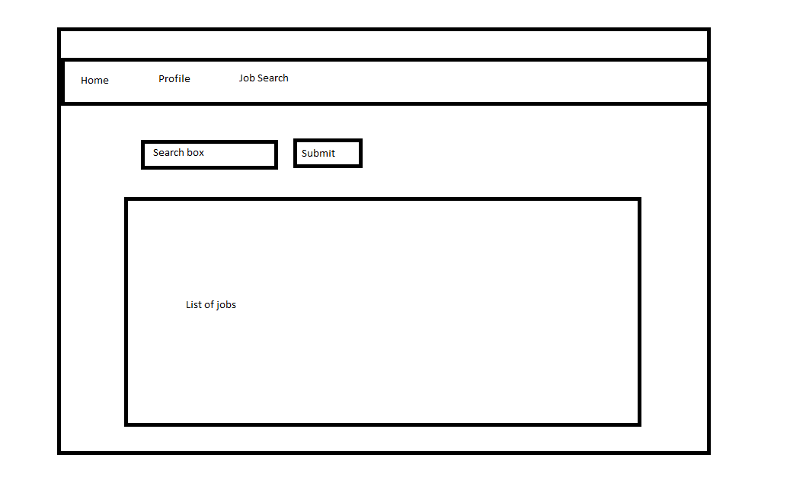
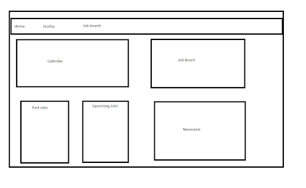

# Freelancer Homepage

This project serves as both a mockup component for what a freelancer will experience when they use the service in the future and as a practice as I continue to hone my skills as a developer

## Description

### Technical Used 

- React
- HTML
- CSS
- Javascript
- syncfusion
- material-ui

### Wireframes

### User Stories

- Navigation bar at the top which has several categories (clickables will be Home, Dashboard, Profile)
- Home Page
    -   This is where you'll be greeted with an inspirational quote to start your day
- Dashboard
    -   Top third will display your past and upcoming jobs where you can delete by clicking on them. It also includes a form to allow you to add more jobs
    -   The middle third is a calendar which will allow you to visualise your appointments
    -   The bottom third will be a job board which allows you to see a description as you hover, visit their website, and go to apply on the link
- Profile
    -   A friendster-esque format which has your details on the left, followed by a write up of the freelancer on the right and a review box at the bottom

## Planning and Development Process

As I am looking to start a startup with a friend of mine, I thought why not just create a segment of what I would like the user to experience. 

Given my knowledge thus far, I am dedicating this project to creating a mockup of a freelancer’s homepage when he/she accesses the platform. It’ll (hopefully) be an ideal one-stop platform to see a summary of their jobs (past and upcoming), search for jobs, schedule and manage their profiles.

During the development, I usually focused on the functionality of each component first before moving on to the CSS. However, as the project went on, I came to understand also the importance of UX/UI such that I would want to continue honing my design skills as well to produce something in the future that is both aesthetically and functionally pleasing. 

### Problem-Solving Strategy

Every time I face an obstacle, I would usually refer to youtube or forums to clear doubts, if not I would consult peers. If I couldn't solve the issue, I would pivot and find an alternative way of producing a similar result.

### Unsolved problems

- Unique users when visiting the site
    - Review box can be edited and commented by anyone under any alias
    - Changes in appointments can be made by anyone
- Job data not as ideal, would require my own data as I collect them in the future
- Schedular component still not fully utilised (changes made there won't make changes to upcoming/past jobs)
- Many more features that I would like to add as I learn more along the way

## APIs Used

Adzuna - Wanted to find an API for freelance jobs in Singapore but this was the closest I could find. This api provided basic details needed for the job board.

Quotable - As we're big on empowerment (thus calling ourselves OWN it), a random inspirational quote could be what's needed to urge someone to hustle

---

## Acknowledgments

- General Assembly for the guidance and lessons 
- Dev World for the firebase tutorial which allowed me to manage data live

---

 ## References
